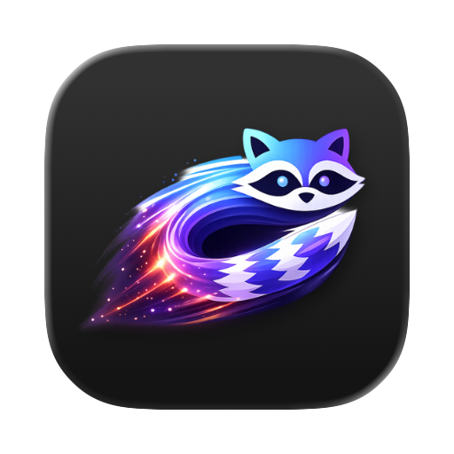

<p align="center">
   <a href="https://con.nowledge.co"></a>
</p>
<h1 align="center">con</h1>
<p align="center"><strong>The terminal emulator with AI harness, nothing more</strong></p>

<p align="center">
  Open source. GPU-accelerated. Terminal-first.
</p>
<p align="center">
  Built for SSH, tmux, and agent-native workflows.
</p>

<p align="center">
  <a href="https://opensource.org/licenses/MIT"></a>
  <a href="https://github.com/nowledge-co/con-terminal/releases/latest"></a>
  <a href="https://developer.apple.com/macos/"></a>
  <a href="https://github.com/nowledge-co/con-terminal/issues/34"></a>
  <a href="https://github.com/nowledge-co/con-terminal/issues/18"></a>
  <a href="https://www.rust-lang.org/"></a>
</p>

## Why con?

`con` is for people who want a serious terminal first and AI help only when it earns its place.

If you're an old-school terminal user and only want enough AI harness when needed, nothing more or less, `con` is for you.

## What it does

- a terminal that is fast and elegant
- a built-in AI harness that can read context, ask before acting, and work directly in the terminal you can already see
- terminal-native workflows for CLI work, with `ssh`, `tmux`, and coding-agent-aware orchestration

## Status

`con` is in active beta development.

- **macOS** fully supported, beta.
- **Windows** early beta. Tracker: [#34](https://github.com/nowledge-co/con-terminal/issues/34).
- **Linux** preview. Tracker: [#18](https://github.com/nowledge-co/con-terminal/issues/18).

## Screenshot

<p align="center">
  <a href="docs/screenshots.md">
    
  </a>
</p>


<p align="center">
  <a href="docs/screenshots.md">View the full screenshot gallery</a>
</p>


## 2 min know-how

<p align="center">
  <video controls muted playsinline width="100%" src="https://github.com/user-attachments/assets/2b6f6145-e400-4a74-a951-cd8221493a17"></video>
</p>

Quick controls:

| Action | macOS | Windows / Linux |
| --- | --- | --- |
| Switch focus between terminal and input | <kbd>⌘</kbd> <kbd>I</kbd> | <kbd>⌃</kbd> <kbd>⇧</kbd> <kbd>I</kbd> |
| Show or hide the bottom input bar | <kbd>⌃</kbd> <kbd>\`</kbd> | <kbd>⌃</kbd> <kbd>\`</kbd> |
| Show or hide the agent panel | <kbd>⌘</kbd> <kbd>L</kbd> | <kbd>⌃</kbd> <kbd>⇧</kbd> <kbd>L</kbd> |
| Cycle bottom-bar mode | <kbd>⌘</kbd> <kbd>;</kbd> | <kbd>⌃</kbd> <kbd>;</kbd> |

- Smart mode decides whether your text is a shell command or an agent request.
- Command mode runs shell commands. With multiple panes, the pane mini map lets you choose the focused pane, all panes, or a selected set.
- Agent mode sends text directly to the built-in agent.

## Install

**macOS, Homebrew**

```sh
brew install --cask nowledge-co/tap/con-beta
```

This installs the app and exposes `con-cli` on your PATH for automation.

**macOS**

```sh
curl -fsSL https://con-releases.nowledge.co/install.sh | sh
```

This installs the app into `/Applications` and links `con-cli` into
`~/.local/bin`. Or download the DMG directly from
[Releases](https://github.com/nowledge-co/con-terminal/releases).

**Linux** (preview)

```sh
curl -fsSL https://con-releases.nowledge.co/install.sh | sh
```

This installs both `con` and `con-cli` into `~/.local/bin`. Or download
`con-<version>-linux-x86_64.tar.gz` from the latest
[Release](https://github.com/nowledge-co/con-terminal/releases).

**Windows**

```powershell
irm https://con-releases.nowledge.co/install.ps1 | iex
```

This installs `con-app.exe` and `con-cli.exe` into the same PATH directory.
Or download `con-windows-x86_64.zip` from the latest
[Release](https://github.com/nowledge-co/con-terminal/releases).

For Scoop users, here's how to install:

```powershell
scoop bucket add jam https://github.com/EFLKumo/jam
scoop install jam/con-terminal
```

This will make con portable and add `con-app` and `con-cli` to your PATH.

To build from source, see `HACKING.md`.

## Docs

Start here:

- [Install](docs/install.md): get con on macOS, Windows, or Linux.
- [Quick controls](docs/quick-controls.md): focus switching, agent panel, and command modes.
- [Terminal workflows](docs/terminal-workflows.md): tabs, panes, broadcast, pane zoom, links, and surfaces.
- [Built-in agent](docs/agent.md): use AI help without leaving the terminal.
- [Settings](docs/settings.md): choose providers, themes, suggestions, skills, and shortcuts.
- [Skills and workflows](docs/skills-and-workflows.md): turn repeated terminal routines into project or personal slash commands.
- [Workspace layout profiles](docs/workspace-layout-profiles-guide.md): save a project layout, reopen it later, or share it with a team.
- [con-cli and surfaces](docs/con-cli.md): build scripts, test runners, and external agent orchestrators on top of con.
- [Screenshot gallery](docs/screenshots.md): a visual tour of the app.
- [Release notes](CHANGELOG.md): what changed in each beta.

For contributors:

- [Contributor quickstart](HACKING.md): build, test, and release from source.
- [Architecture](DESIGN.md): product direction and system design.
- `docs/impl/` and `docs/study/`: implementation records and research notes.

## License

[MIT](LICENSE)

## Credits ♥️

`con` depends on upstream projects we rely on directly and respect deeply:

- [Ghostty](https://github.com/ghostty-org/ghostty) for the terminal runtime and rendering foundation that powers our embedded terminal surfaces.
- [GPUI](https://github.com/zed-industries/zed/tree/main/crates/gpui) from the Zed team for the native GPU UI framework we build the shell on.
- [gpui-component](https://github.com/longbridge/gpui-component) from the Longbridge team for the component library that accelerates much of the UI layer.
- [Rig](https://github.com/0xPlaygrounds/rig) for the lovely Rust agent framework behind `con`'s AI harness.
- [Phosphor Icons](https://phosphoricons.com/) for the icon system used across the app.
- [Flexoki](https://stephango.com/flexoki) for the default visual theme direction.
- [Iosevka](https://typeof.net/Iosevka/) and [Ioskeley Mono](https://github.com/jewlexx/ioskeley) for the mono type foundation used in terminal chrome and code-heavy UI.

`con` was initially inspired by [warp.dev](http://warp.dev/), but is doing less than warp, if you need more, you should go for warp instead.
